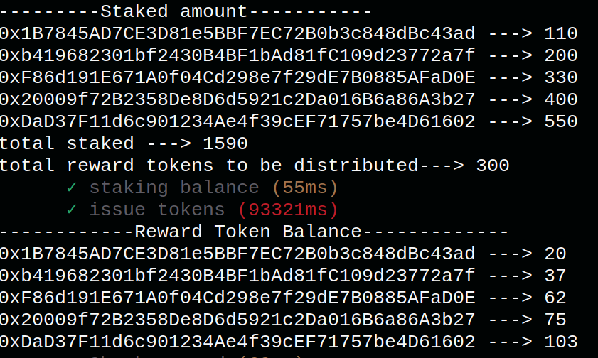
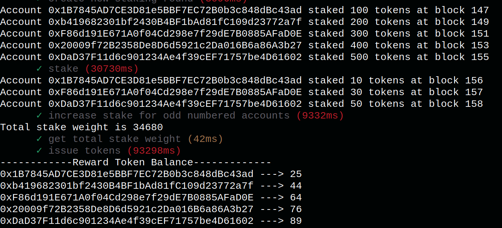
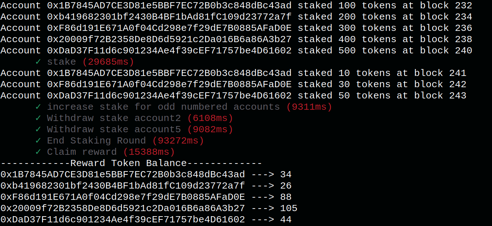

# Problem statement
    Write a smart contract to distribute  N ERC-20 (reward) token in X number of days. (Rate should be defined per block e.g  N / (X* (number of Blocks per Day)). 

    The reward token will only be received by the people who have staked another token named rapid token in a contract called  a farm contract. 

The following values are considered for testing purposes:
1. Total number of staking days are set as 30 and number of blocks per day is set as 1. That means a staking round is of 30 Blocks.
2. Reward tokens to be distributed per block is set as 10. That means a total of 300 token have to distibuted in a staking round.
3. Five stakers are considered.

# Solution
 I have written the solutions to the problem as follows:

 ## Solution 1 - StakingFarm.sol

 In this solution, the contract will distribute rewards proportional 
 to the staking amount irrespective of when the user has 
 staked the Rapid Tokens. 
 The reward amount per user is calculated as follows:
            
                    (U * X)/N
    
    where $U$ is the amount of Rapid Tokens staked by the user,
     $X$ is the number of reward tokens that have to be distributed in a staking round
    $N$ is the total amount of Rapid Tokens staked by all users

### Output screens

## Solution 2 - StakingFarm2.sol

In this solution, the contract will distribute the rewards proportional to the staking weight. The staking weight is calculated from the amount the user has staked and the time when the user has staked.
The reward per user is calculated as follows:

                (U_{weight} * X)/T_{weight}

    where $U_{weight}$ is the staking weight of the user. It is calculated as
                
                    A * M

    where $A$ is the amount of tokens staked by the user and $M$ is the number of blocks the user has staked that amount. $X$ is the number of reward tokens that have to be distributed in a staking round. $T_{weight}$ is the cummulative staking weight of all the users.

### Output screens

### Solution 3 - StakingFarm3.sol

This solution is similar to the previous solution but has an additional function which allows the users to withdraw their staking tokens before the staking period ends. The rewards are only calculated for the staking peroid.

### Output screens

# Developement and execution environment
1. Truffle.
2. Ganache with 3 sec as block generation time.
3. All three solution contracts have different test files. (truffle test test/StakingFarm.js)

# Final conclusion
1. The objective is to distribute the all the tokens minted within a staking round to be distributed to all the stakers. In all the above solutions, the tokens are distributed completely. 
2. All though I have written test cases, I am not sure that the contracts are robust and error free. Given enough time I may write a well-tested code.
